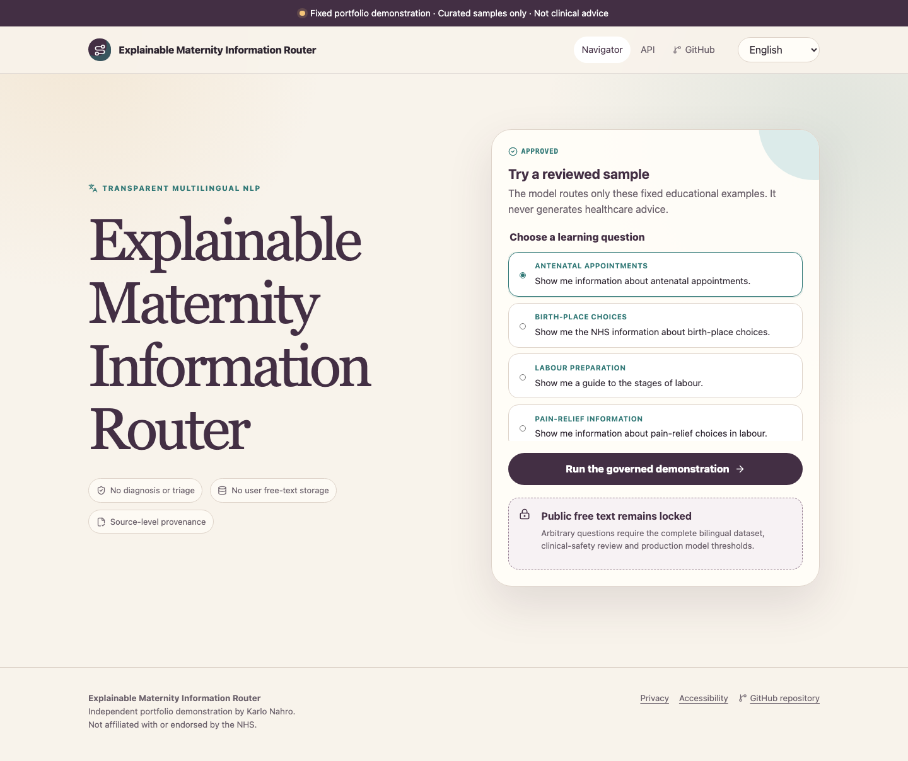
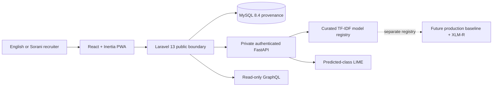

# Maternity Learning Navigator

A recruiter-facing demonstration of a real PHP → Python → model → LIME → PHP → React request path, backed by MySQL source provenance and both REST and read-only GraphQL APIs.

The project routes only fixed, reviewed maternity-learning examples. It does **not** diagnose, triage, recommend treatment, predict outcomes, translate clinical advice or generate healthcare answers. It is an independent portfolio project and is not affiliated with or endorsed by the NHS or The Real Birth Company.

> **Current release state:** implementation complete; exact bilingual content review remains open. No demo artifact is served and unrestricted free text remains locked until its separate production gates pass.

## What a recruiter can inspect

Within the application a recruiter can:

1. choose English or Kurdish Sorani and see full document LTR/RTL behavior;
2. select one of 12 recruiter-visible fixed questions after checksum approval;
3. see Laravel call a private authenticated FastAPI model service;
4. receive MySQL-backed source cards with explicit language fallback;
5. request a deterministic LIME explanation of the actual predicted class; and
6. execute live REST and GraphQL calls from the in-browser API exhibit.

While review is open, the same journey transparently shows `changes_required` and releases no sample or model. That is intentional fail-closed behavior, not a simulated result.



## Architecture



The curated and production registries validate different `intended_mode` and `release_status` values. A demo artifact therefore cannot unlock or masquerade as a production model.

## Technology

- PHP 8.4, Laravel 13, Inertia and Lighthouse GraphQL
- React 19, TypeScript, Vite and an installable PWA
- MySQL 8.4 with `utf8mb4`
- Python 3.12, FastAPI, scikit-learn and LIME
- a separately gated Transformers/XLM-R training path
- Docker Compose locally and a three-service Railway target
- PHPUnit, pytest, Playwright, axe and GitHub Actions

## Curated demonstration contract

Public demo routes accept identifiers, never browser-supplied maternity questions:

```http
GET  /api/v1/demo/samples?locale=en
POST /api/v1/demo/classifications
POST /api/v1/demo/classifications/{requestId}/explanation
```

```json
{
  "sample_id": "en-antenatal-11"
}
```

Every demo response includes `"demo_only": true`. Laravel retrieves the reviewed question from MySQL, calls `/v1/demo/classify` on the private model service, verifies that the predicted category matches the reviewed fixture, and persists only derived event metadata plus the governed sample reference.

The unrestricted production contracts remain present but locked:

```http
POST /api/v1/classifications
POST /api/v1/classifications/{requestId}/explanation
```

They cannot be enabled by the curated dataset, model or sign-off.

## Correct LIME behavior

The explanation service:

- calculates the predicted class index before invoking LIME;
- passes that index explicitly to `explain_instance` and `as_list`;
- rejects predicted/explained-class disagreement;
- uses seed `41`, 1,000 perturbations and no more than eight features;
- returns signed weights, supporting/opposing labels and exact original-text spans;
- keeps Sorani features in source-text order for RTL rendering; and
- discards all explanation output after the response.

LIME is labelled local, approximate, non-causal and explanatory of topic routing only. It is never evidence that a source or statement is medically correct.

## Governed bilingual data

`resources/demo_samples.csv` contains exactly 144 fixed educational questions:

| Per category and language | Count |
| --- | ---: |
| Demonstration training examples | 10 |
| Recruiter-visible fixture | 1 |
| Hidden end-to-end fixture | 1 |

Across six categories and two languages this produces 120 training rows, 12 visible fixtures and 12 hidden fixtures. Paraphrase families cannot cross those splits.

The Sorani text is currently labelled `draft_machine_assisted`. Karlo Nahro is recorded as a native Sorani speaker and professional translator, but the exact 72 Sorani questions, interface catalogue and RTL presentation are still `changes_required` until their current checksums are reviewed. Clinical-safety review remains independently pending and continues to block production free text.

Review evidence:

- [Exact bilingual review packet](governance/CURATED_DEMO_REVIEW.md)
- [Machine-readable demo decision](governance/demo_review_manifest.json)
- [Machine-readable sign-off state](governance/review_signoffs.json)
- [Fixed question corpus](resources/demo_samples.csv)
- [Shared interface catalogue](app/resources/js/interface-catalog.json)

The validator recomputes those checksums and refuses an approval whose content has changed.

## REST and GraphQL

Additional REST evidence routes:

```http
GET  /api/v1/health
GET  /api/v1/resources?category=antenatal-appointments&locale=ckb
GET  /api/v1/model-card
GET  /api/v1/openapi.json
POST /api/v1/feedback
```

GraphQL at `/graphql` is read-only:

```graphql
query RecruiterEvidence {
  categories(locale: "en") { slug label description }
  resources(category: "antenatal-appointments", locale: "ckb") {
    code
    title
    language
    requestedLocale
    fallbackUsed
  }
  modelVersion { modelId version status limitations }
}
```

The live API page displays the exact request, response, HTTP status and elapsed time, with copyable curl, JavaScript and Laravel/PHP examples. The OpenAPI 3.1 document covers success, validation, conflict, throttling and unavailable-service responses.

## Privacy and responsible design

- Demo routes reject `question` and `locale` fields and accept only an approved visible `sample_id`.
- No routing-event column exists for raw questions or LIME tokens.
- Arbitrary questions, names, contact details, symptoms, patient records and free-text feedback are not stored.
- Model-service access logging is disabled.
- Sorani results identify English-only source fallback rather than implying translation parity.
- Offline mode retains the application shell and registered source metadata but disables model calls.
- Real Birth Company material remains link-only; no branding, course content, images or testimonials are copied.
- Governance is informed by [NHS clinical decision-support guidance](https://www.england.nhs.uk/long-read/supporting-clinical-decisions-with-health-information-technology/), [DCB0129](https://digital.nhs.uk/data-and-information/information-standards/governance/latest-activity/standards-and-collections/dcb0129-clinical-risk-management-its-application-in-the-manufacture-of-health-it-systems/) and [MHRA software/AI guidance](https://www.gov.uk/government/publications/software-and-artificial-intelligence-ai-as-a-medical-device), without claiming certification or formal compliance.

## Local setup

Prerequisites: Docker and Docker Compose.

```bash
cp .env.compose.example .env
cp app/.env.example app/.env
```

Replace every placeholder in `.env`, then run:

```bash
docker-compose up -d --build mysql ml app
docker-compose exec -T app php artisan migrate --force
docker-compose exec -T app php artisan db:seed --force
```

Open [http://localhost:8080](http://localhost:8080).

The repository contains no Compose password, service token or production secret. `.env` and `app/.env` are excluded from Git and the Docker build context.

## Validation

```bash
python3 scripts/validate_resources.py

docker build -t maternity-learning-navigator-ml ml-service
docker run --rm -v "$PWD/ml-service:/service" -w /service \
  maternity-learning-navigator-ml python -m pytest -q

docker build -f docker/test.Dockerfile -t maternity-learning-navigator-tests .
docker run --rm maternity-learning-navigator-tests php artisan test

cd app
npm ci
npx playwright install chromium
npm run test:e2e
```

Current verified checks:

- 11 Python tests: review/checksum gates, artifact isolation, tamper refusal, predicted-class LIME, reproducibility and Sorani source order
- 13 Laravel tests: migrations, sample-ID-only contracts, free-text lockout, explanation binding, persistence boundaries, locale fallback, OpenAPI and failure contracts
- 5 Playwright journeys: English, Sorani/RTL, live REST/GraphQL, offline refusal and axe accessibility
- production frontend and both deployable containers build successfully

CI uses MySQL 8.4 integration tests, validates governed files, audits Composer/npm dependencies, scans Git history for secrets, smoke-tests the private service topology and runs the browser suite.

## Vacancy evidence

| Requirement | Direct evidence |
| --- | --- |
| PHP and MySQL | Laravel controllers, migrations, Eloquent relationships, governed importer and MySQL 8.4 CI service |
| REST and GraphQL | Versioned write endpoints, OpenAPI 3.1, read-only Lighthouse schema and live in-browser console |
| Python and model deployment | Private FastAPI container, immutable manifest contract and isolated model registries |
| NLP and multilingual work | Word/character TF-IDF routing, English/Sorani corpus, BCP-47 `ckb` and full RTL |
| LIME / responsible AI | Actual predicted-class explanation, fixed seed, signed source spans, transient output and non-causal limitations |
| Cloud and offline architecture | Three-service Railway design, private model/database networking and restricted PWA cache |
| Full data lifecycle | Source registration, review states, checksum validation, leakage-safe families, training, fixture evaluation and artifact packaging |
| UI and communication | 90-second recruiter journey, accessible explanation, API exhibit, evidence page and plain-language boundaries |
| Healthcare/regulatory awareness | Educational intended purpose, explicit exclusions, hazard log and no clinical-validation or endorsement claims |

## Honest limitations and follow-on work

- The curated corpus supports fixed fixture demonstrations only. It cannot support a general accuracy claim.
- Public demo serving waits for approval of the exact English/Sorani dataset and interface checksums.
- Unrestricted free text additionally requires the full 600-row bilingual dataset, 120 evaluation fixtures and independent clinical-safety review.
- XLM-R remains unserved until the governed production dataset exists and every original performance/release threshold passes.
- `maternity.karlonahro.com`, public repository visibility and portfolio-site integration are release steps after the curated review gate passes.
