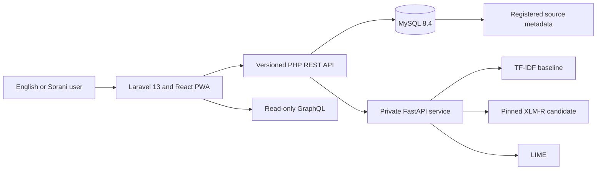
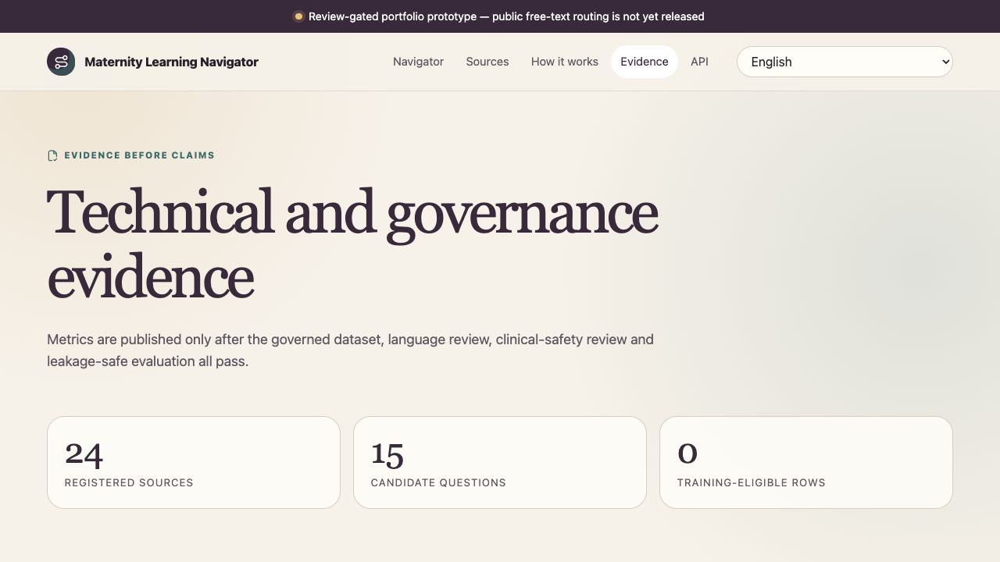

# Maternity Learning Navigator

A review-gated, multilingual maternity learning resource router built as an independent AI engineering portfolio project. It connects a Laravel/PHP and MySQL application to a private Python model service, exposes REST and read-only GraphQL APIs, and is designed to explain topic-routing decisions with LIME.

The application does **not** diagnose, triage, recommend treatment, predict birth outcomes, translate clinical advice or generate healthcare answers. It is not affiliated with or endorsed by the NHS or The Real Birth Company.

## Honest current status

The complete local-first application foundation, source registry, public API contracts, data model, review-gated Sorani/RTL structure, PWA boundary, gated training code and release evidence are implemented. Public free-text routing is deliberately locked because:

- the dataset currently has 15 candidates and **zero training-eligible rows**;
- qualified Sorani-language review has not been supplied;
- qualified clinical-safety review has not been supplied; and
- no maternity-domain model result may be claimed before those gates and the metric thresholds pass.

The interface therefore provides direct source browsing and demonstrates the fail-closed release gate. It does not display invented confusion matrices, accuracy scores, translations or LIME output.


## Architecture



### Technology

- PHP 8.4, Laravel 13.24, Inertia and Lighthouse GraphQL
- React 19, TypeScript, Tailwind CSS 4 and an installable Vite PWA
- MySQL 8.4 with `utf8mb4`
- Python 3.12, FastAPI, scikit-learn, Transformers, CPU-only PyTorch and LIME
- Docker Compose locally; deployment-ready service separation for Railway
- GitHub Actions for governance, PHP, frontend and Python validation

## Recruiter walkthrough

1. Open the navigator and inspect its intended-use boundary.
2. Submit a question and observe the human-review gate fail closed.
3. Browse the six educational topics and inspect every source's organisation, language, use status and verification date.
4. Open **Evidence** to see the real dataset state, architecture, limitations and vacancy alignment.
5. Open **API** to inspect the REST and GraphQL surface.



## Local setup

Prerequisites: Docker with Compose.

```bash
cp app/.env.example app/.env
docker-compose build
docker-compose up -d
docker-compose exec app php artisan migrate --seed
```

Open `http://localhost:8080`.

The supplied Compose values are local-development credentials only. Replace all passwords, tokens, the HMAC key and application key before any hosted deployment.

## Interfaces

REST:

- `POST /api/v1/classifications`
- `POST /api/v1/classifications/{requestId}/explanation`
- `GET /api/v1/resources`
- `GET /api/v1/model-card`
- `POST /api/v1/feedback`
- `GET /api/v1/openapi.json`
- `GET /api/v1/health`

GraphQL at `/graphql` is read-only and exposes `categories`, `resources`, `source` and `modelVersion`.

## Privacy and responsible-AI design

- Raw questions, LIME tokens, names, contact details, symptoms and free-text feedback have no database fields.
- Questions are sent to the private model service only after release approval.
- A keyed fingerprint lets an explanation request prove it contains the same text without persisting that text.
- Model access logging is disabled; application request bodies are excluded from logs.
- LIME is described as an approximate local explanation of routing, never a clinical or causal explanation.
- Offline mode caches the interface and source metadata only. Classification is disabled offline.
- Real Birth Company sources are link-only. No course content, branding, images or testimonials are copied.

## Training lifecycle

The Python pipeline validates review states, requires 50 approved examples for each of six categories in each language, requires 30 out-of-scope and 30 safety-bypass fixtures per language, groups splits by paraphrase family, trains a word/character TF-IDF baseline and contains a separately pinned XLM-R training path. Generated manifests default to `evaluation_only`; serving refuses missing, modified, schema-incompatible or unapproved artifacts.

The default model-service image stays lean for the baseline. `ml-service/Dockerfile.transformer` and `ml-service/Dockerfile.training` use the [official PyTorch CPU wheel index](https://download.pytorch.org/whl/cpu/torch/) for an XLM-R candidate, avoiding CUDA packages on the deployment target. The clinical reviewer must create an approved safety-rule file from `resources/safety_bypass_rules.template.json`; the repository deliberately contains no invented safety phrases.

The public release thresholds are recorded in [governance/MODEL_CARD.md](governance/MODEL_CARD.md). Human gates cannot be signed by the project author or an AI agent.

## Vacancy evidence

| Requirement | Evidence in this project |
| --- | --- |
| Python, PHP, MySQL | Private FastAPI model service, Laravel application and governed relational data model |
| REST and GraphQL | Versioned REST contracts, OpenAPI document and read-only Lighthouse schema |
| Deep learning and NLP | Leakage-safe baseline pipeline and pinned XLM-R fine-tuning path |
| Responsible and explainable AI | Release gates, model/dataset cards, hazard log and transient LIME explanations |
| Cloud and offline storage | Portable service containers, private-network design and restricted PWA cache |
| Full data lifecycle | Source provenance, review metadata, validation, splitting, training, evaluation, checksums and release manifests |
| Visualisation and UI | Recruiter-facing evidence panels, planned real metric visualisations and responsive accessible UI |
| Multilingual | BCP-47 `ckb`, RTL rendering and qualified Sorani review gate |
| Regulatory awareness | Explicit intended purpose, MHRA boundary, proportionate DCB0129 hazard awareness and no certification claims |

## Governance documents

- [Source and language policy](resources/SOURCE_POLICY.md)
- [Resource acquisition report](resources/RESOURCE_ACQUISITION_REPORT.md)
- [Dataset card](governance/DATASET_CARD.md)
- [Model card](governance/MODEL_CARD.md)
- [Hazard log](governance/HAZARD_LOG.md)
- [Data flow](governance/DATA_FLOW.md)
- [Accessibility plan](governance/ACCESSIBILITY_PLAN.md)
- [Release checklist](governance/RELEASE_CHECKLIST.md)
- [Independent review template](governance/REVIEW_SIGNOFF_TEMPLATE.md)

## Validation

```bash
python3 scripts/validate_resources.py
docker build -t maternity-learning-navigator-ml ml-service
docker run --rm maternity-learning-navigator-ml python -m pytest -q
docker build -f docker/test.Dockerfile -t maternity-learning-navigator-tests .
docker run --rm maternity-learning-navigator-tests
docker build -f docker/app.Dockerfile -t maternity-learning-navigator-app .
```

Deployment, `maternity.karlonahro.com`, public repository visibility and portfolio integration remain release tasks after the independent review and evidence gates pass.
